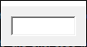
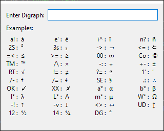
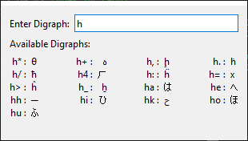

# Digraph Tool





## About the Tool

This tool can be used to simplify the process of entering special characters.  Instead of
remembering obscure alt-codes like Alt-0176 for a degree sign, Alt-0233 for an e with an
acute accent or Alt-230 for the Greek letter mu, these can be entered by hitting a
standard short-cut key (e.g. `Win+K`) followed by two characters that are logically chosen
to represent the symbol.  For the examples above, the degree symbol (`°`) uses the
characters `DG`, the e with an acute accent (`é`) is `e'` and the letter mu (`μ`) is
entered as `m*` (all Greek characters can be typed as the Latin equivalent followed by
`*`).

The tool can also be useful on laptops that don't have a numeric keypad, upon which the
Alt key codes rely.

There are some examples of common digraphs in [`docs/digraph_table.xlsx`][digraphxlsx]
(the first section is standard suffixes such as `'` for an acute accent or `*` for Greek
letters, the others show specific digraphs).  There's [also a PDF of this][digraphpdf] if
you don't have anything that will read xlsx spreadsheets or just want a print-out.

The digraphs were taken from those used in [Vim text editor][vim]; a full list is
available at [http://vimhelp.appspot.com/digraph.txt.html#digraph-table][vimlist] or in
a slightly more cryptic format in [entries.txt](config/entries.txt) - the first column is
the digraph and the second column is the unicode character number (in hexadecimal if
prefixed with `0x`, otherwise in decimal).

The special digraph "VE" will show the version number of the application.  Digraphs are
case sensitive: `w*` produces `ω`; `W*` produces `Ω`.  If a digraph isn't recognised, the
tool will try swapping the letters round to see if a valid digraph exists in the opposite
order (for example, `\/` is an invalid digraph, but `/\` is the digraph for `×`, so if you
type `\/`, the tool will assume you meant `/\`).  If no digraph can be found in either
order, an error message is printed.

Digraphs will only work if the font in use in whatever application you're typing into
supports the particular character.  Otherwise you'll get a blank space or a symbol showing
an invalid character.  Of course some symbols may produce deliberate blank spaces (e.g.
`NS` produces a [non-breaking space](https://en.wikipedia.org/wiki/Non-breaking_space)
character).

Note that the tool works by inserting the symbol into the clipboard and then sending
`Shift-Insert` to the last active window.  This has a few implications:

1. It will overwrite whatever was previously in the clipboard.
2. If Windows is going a bit slowly, the paste will fail as the window switch won't have
   happened in time.  In this case, just press `Ctrl-V` or `Shift-Insert` manually.
3. Applications that don't accept `Shift-Insert` as paste won't paste the character in so
   you'll have to do it manually (or configure a custom paste command).

You can override the pasting commands using `config/settings.ini`.  With the default
configuration, `Ctrl-R, +` is sent if the last active window included the text "GVIM" in
the title.  Otherwise `Shift-Insert` is sent.  If you want to change the default to be
`Ctrl-V`, then change `+{INS}` to `^v` in `settings.ini`.  In my experimentation,
`Shift-Insert` seems to work in most applications, hence choosing it as the default.

## Keyboard Shortcut Prefix

To create a keyboard shortcut, there are two methods that work equally well:

* Create a Windows shortcut on your start menu and set the shortcut key appropriately.
* Use [AutoHotKey (https://autohotkey.com/)][autohotkey] and install a simple script to
  run the executable when you press the chosen key.  [An example autohotkey script is
  included in the `docs` folder][exampleautohotkey].

The second option is probably a bit faster, but either should work.

## Choosing the Window Size

There are two versions of the digraph window.  The default version is a very small and
unobtrusive window with a box into which you can type the digraph.  It looks like this:


It's also possible to show a larger window with some examples of possible digraphs:


Once you press the first letter of your chosen digraph, the examples change to show the
available digraphs starting with that letter:



To use the larger window, there are two options:

* Pass `--large` as a command line argument: this can be done in the Windows shortcut
  configuration or the autohotkey script as required.  If you use the [autohotkey script
  in the `docs` folder][exampleautohotkey], `Win+J` will open the large window and `Win+K`
  will open the smaller one.
* Edit `config/settings.ini` and add this:

```
[UI]
LargeWindow = true
```

## Binary Versions

There are a several builds included in the releases:

1. Dynamic linking, minimised selection of DLLs to save space
2. Dynamic linking, all Qt DLLs
3. Static linking (smallest file, slowest start)

In most cases, it probably doesn't make much difference which one you use: they all do the
same thing.  The statically compiled version (suffix `static`) contains everything needed
within one binary file and is a much smaller download than the other versions.  However,
it seems to be a little slower to start than the dynamically linked versions.

The dynamically linked versions include the DLLs that are required by the
application.  The resulting download size was huge, so in the minimised selection version
(suffix `min-dlls`), I've tried to remove any that didn't seem necessary.  If that doesn't
work on your PC or you have no concerns about space / bandwidth, the version with all the
DLLs should be a safe bet.

## Other Operating Systems

The tool is written using the Qt graphical user interface library.  In principle, it
should be straightforward to port it to Linux or Mac OS X.  The only Windows-specific
parts of the code are in `windows_specific.cpp` and are responsible for sending the
"paste" keyboard shortcut to the last active application.

## Building from Source

There are several options for building from source: using docker to cross-compile the
executable from a Linux system, building with msys2 or using the standard Qt tools.

### Using docker

Assuming your Linux system includes docker and docker-compose, it should be as simple as
running:

```bash
docker-compose build && docker-compose up
```

The first time that command is run will take a long time as the Qt libraries are built
from source.

### Using MSYS2

To build using MSYS2, please try following these instructions.  I haven't verified them
on a cleanly set-up system, so I can't be sure they work, but please get in touch if you
have issues and I'll try to help.

1. Install http://msys2.github.io/
2. After following the instructions to install it, run the following commands in the MSYS prompt:

```bash
pacman -S base-devel
pacman -S mingw-w64-x86_64-toolchain #for compiling x64 binaries
pacman -S lzip #for extracting gmp
pacman -S mingw-w64-x86_64-qt6-shared mingw-w64-x86_64-qt6-static mingw-w64-x86_64-qt6-tools
```

3. Build the project:

```bash
./build_win_release.sh
```

or:

```bash
./build_win_console.sh
```

The latter version will show a console window with debugging information printed.

### Using the standard Qt Tools

This should be relatively straightforward as I believe the Qt IDE will open `.pro` files.
However, I haven't tried this method as I prefer the reproducible builds that come from
automated scripts rather than IDEs.

[autohotkey]: https://autohotkey.com/
[vimlist]: http://vimhelp.appspot.com/digraph.txt.html#digraph-table
[vimdig]: http://vimhelp.appspot.com/digraph.txt.html#digraphs-use
[vim]: http://www.vim.org
[exampleautohotkey]: docs/example_autohotkey_script.ahk
[digraphpdf]: docs/digraph_table_landscape.pdf
[digraphxlsx]: docs/digraph_table.xlsx

<!-- vim: set ft=markdown tw=90 : -->
